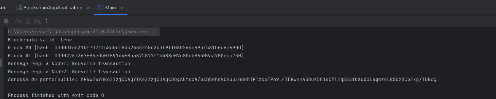
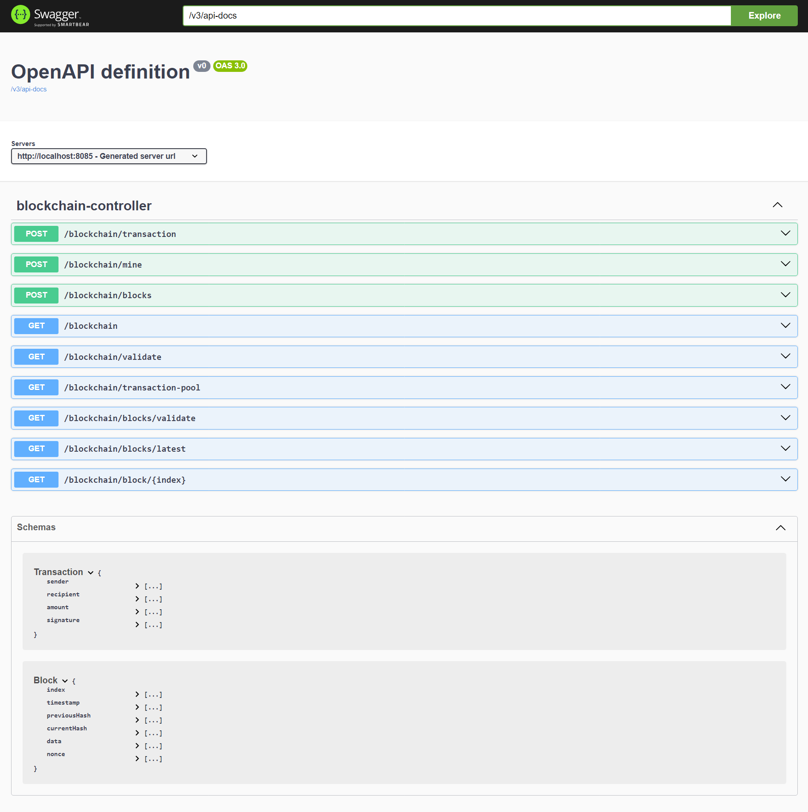
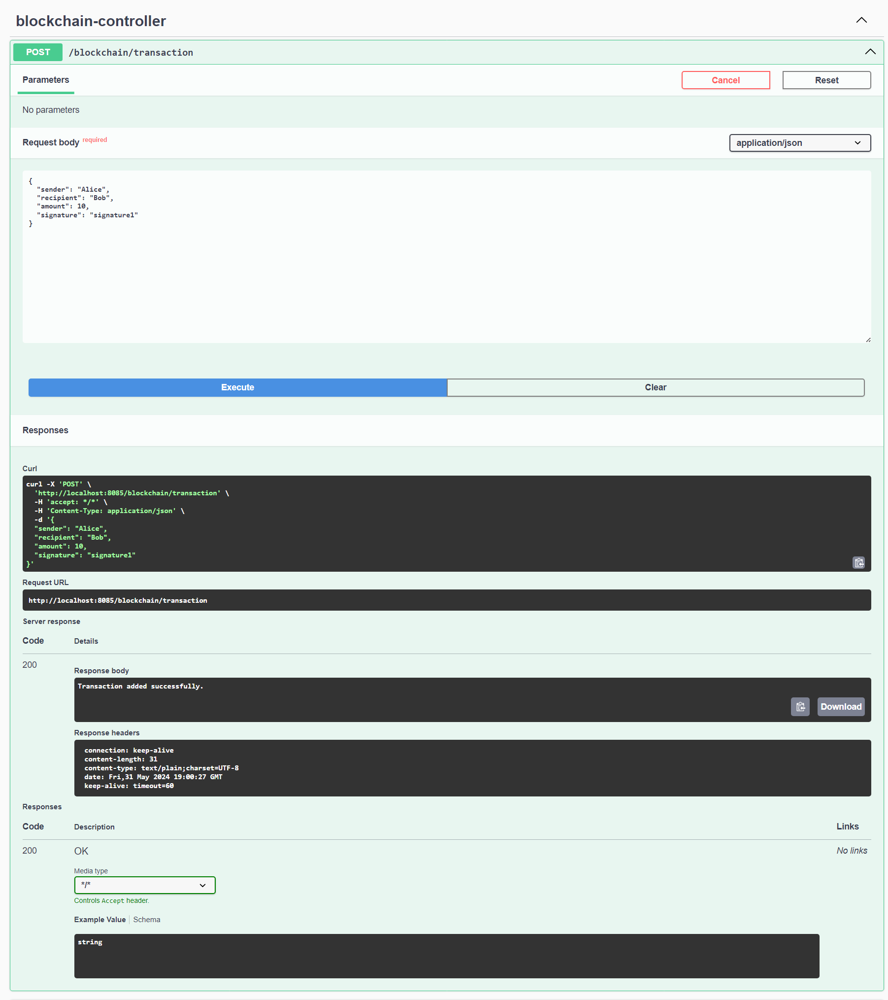
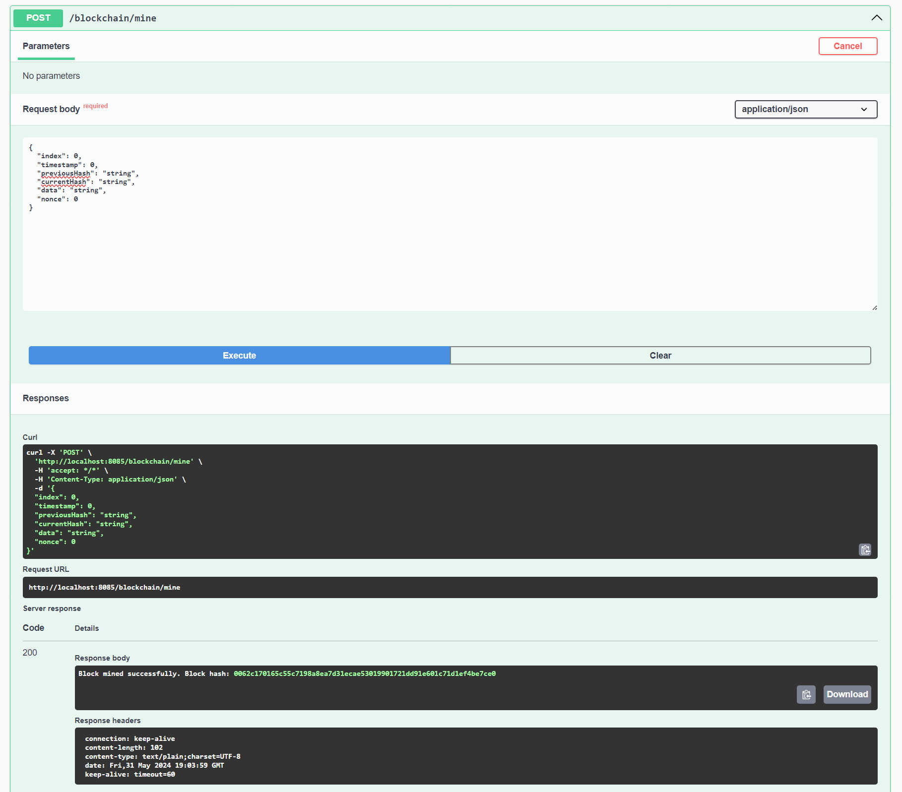
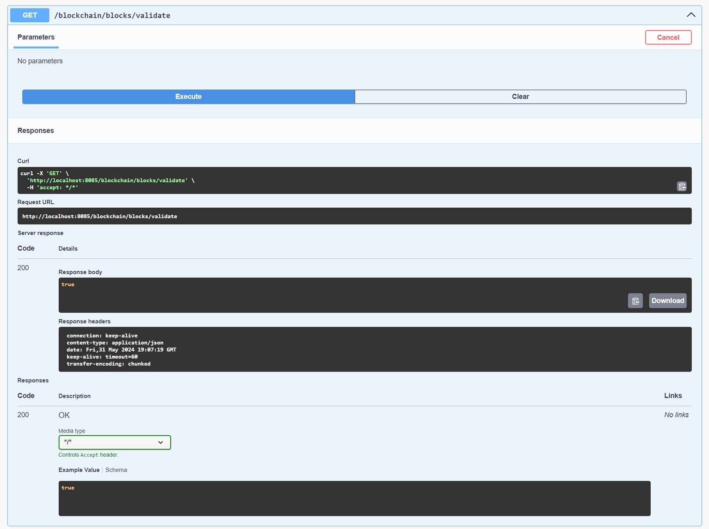
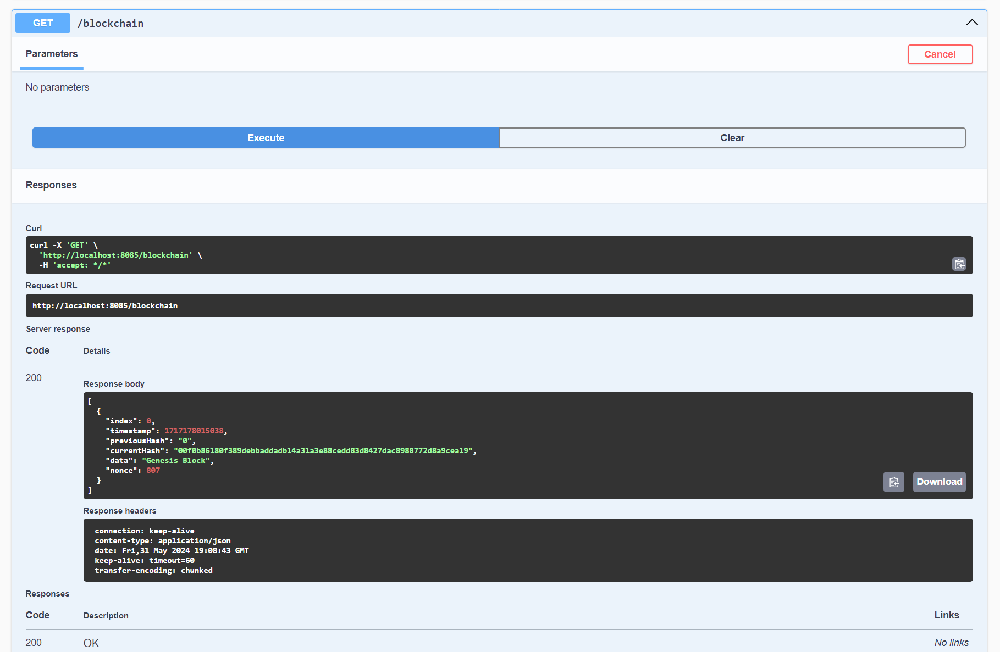

# Blockchain Workshop

## Introduction
Blockchain technology introduces a decentralized and immutable ledger that enables secure and transparent transactions without intermediaries. It has the potential to disrupt industries such as finance, supply chain management, healthcare, and more. Understanding the inner workings of a blockchain will allow you to grasp its underlying principles and apply them to real-world scenarios.

## Blockchain Components

### Block Class

### Blockchain Class

### Hashing Function

## Transaction Pool

## Proof of Work Implementation

## Block Validation

## Additional Features

### Peer-to-Peer Networking

### Wallet Management

### Main Class

### Swagger

### Ajout de quelques transactions

### Minage des transactions

### Validation de la blockchain

### Affichage des blocs

